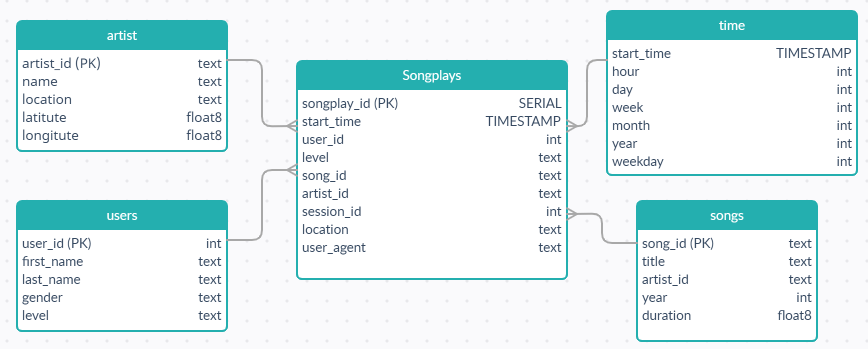

# Project Summary
## Introduction
A music streaming startup, Sparkify, has grown their user base and song database even more and want to move their data 
warehouse to a data lake. Their data resides in S3, in a directory of JSON logs on user activity on the app, as well as
a directory with JSON metadata on the songs in their app.

As their data engineer, you are tasked with building an ETL pipeline that extracts their data from S3, processes them
using Spark, and loads the data back into S3 as a set of dimensional tables. This will allow their analytics team to
continue finding insights in what songs their users are listening to.

You will be able to test your database and ETL pipeline by running queries given to you by the analytics team from 
Sparkify and compare your results with their expected results.

## Description
The project includes an ETL pipeline using Spark with Pyspark API to extract data from S3 bucket
`s3://udacity-dend/song-data` and `s3://udacity-dend/song-data` and load them to `s3://xzbits-sparkify-data-lake/`.
By deploying AWS EMR service to run ETL pipeline and building data lake on `s3://xzbits-sparkify-data-lake/`

## Database design in STAR schema


## How to run Python file
# Step 1: Create AWS EMR cluster with the reference configuration as below:
* Release: `emr-5.20.0` or later
* Applications: `Spark: Spark 2.4.0 on Hadoop 2.8.5 YARN with Ganglia 3.7.2 and Zeppelin 0.8.0`
* Instance type: `m3.xlarge`
* Number of instance: `3`

# Step 2: Connect to your EMR clusters via PuTTY or AWS console

# Step 3: Clone the Python scripts and clarify S3 Bucket
```commandline
git clone https://<YOUR_PERSONAL_ACCESS_TOKEN>>@github.com/xzbits/project4_Data_Lake_DE_ND.git
```

# Step 4: S3 Bucket
```buildoutcfg
[default]
AWS_ACCESS_KEY_ID=
AWS_SECRET_ACCESS_KEY=
AWS_SESSION_TOKEN=
S3_BUCKET=
```
# Step 5: Run ETL pipeline
```commandline
python etl.py
```

# Repository
## `s3://udacity-dend` S3 Bucket
The `s3://udacity-dend` S3 Bucket has 2 separate folders, 
* The `song_data` folder includes all JSON files need for `staging_songs`, `songs` and `artists` tables.
* The `log_data` folder includes all JSON files need for `staging_events`, `users`, and `time` tables.
```
└── s3://udacity-dend
    ├── log_data
    │   └── 2018
    │       └── 11
    │           ├── 2018-11-01-events.json
    │           ├── 2018-11-02-events.json
    │           └── ...
    └── song_data
        ├── A
        │   ├── A
        │   │   ├── A
        │   │   │   ├── TRAAAAW128F429D538.json
        │   │   │   ├── TRAAABD128F429CF47.json
        │   │   │   └── ...
        │   │   ├── B
        │   │   │   ├── TRAABCL128F4286650.json
        │   │   │   ├── TRAABDL12903CAABBA.json
        │   │   │   └── ...
        │   │   └── C
        │   │       ├── TRAACCG128F92E8A55.json
        │   │       ├── TRAACER128F4290F96.json
        │   │       └── ...
        │   └── B
        │       ├── A
        │       │   ├── TRABACN128F425B784.json
        │       │   ├── TRABAFJ128F42AF24E.json
        │       │   └── ...
        │       ├── B
        │       │   ├── TRABBAM128F429D223.json
        │       │   ├── TRABBBV128F42967D7.json
        │       │   └── ...
        │       └── C
        │           ├── TRABCAJ12903CDFCC2.json
        .           ├── TRABCEC128F426456E.json
        .           └── ...
		.
```

## `s3://<YOUR_SPARKIFY_DATA_LAKE>` S3 Bucket
The `s3://<YOUR_SPARKIFY_DATA_LAKE>` S3 Bucket has 5 separate folders. All files stored in columnar format 
which is parquet.

```
└── s3://<YOUR_SPARKIFY_DATA_LAKE>
    ├── artists
    │   ├── part-00000-af2ee25c-baba-40aa-af3c-92d3cafd3735-c000.snappy.parquet
    │   ├── part-00000-af2ee25c-baba-40aa-af3c-92d3cafd3735-c000.snappy.parquet
    │   └── ...
    │
    ├── songplays
    │   └── year=2018
    │       └── month=11
    │           ├── part-00000-56e8f2b7-1773-463d-9845-039bf497b913.c000.snappy.parquet
    │           └── part-00001-56e8f2b7-1773-463d-9845-039bf497b913.c000.snappy.parquet
    │
    ├── songs
    │   ├── year=0
    │   │   └── artist_id=ARAJPHH1187FB5566A
    │   │       ├── part-00115-c2b58d60-5a85-42c0-94c7-431ed97a4f83.c000.snappy.parquet
    │   │       └── ...
    │   ├── ...
    │
    ├── time
    │   └── year=2018
    │       └── month=11
    │           ├── part-00000-e072f0be-145e-422c-9462-32e90d9c3c1f.c000.snappy.parquet
    │           ├── part-00001-e072f0be-145e-422c-9462-32e90d9c3c1f.c000.snappy.parquet
    │           └── ...
    └── users
        ├── part-00000-83da2a48-88b7-4b23-a867-7be18ea4242e-c000.snappy.parquet
        ├── part-00002-83da2a48-88b7-4b23-a867-7be18ea4242e-c000.snappy.parquet
        └── ...
```
